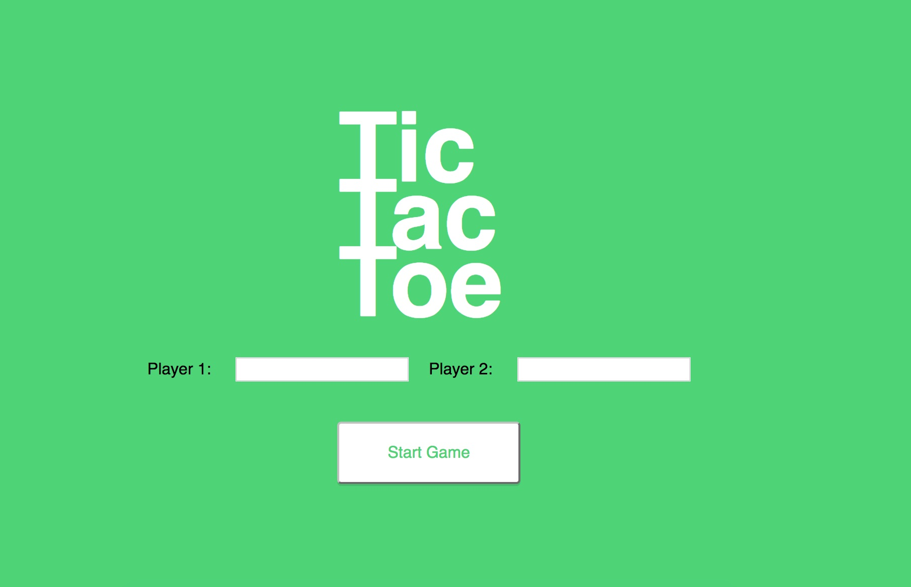

# Project 4 - Tic Tac Toe

  

In this project, I built a functional, two-person Tic Tac Toe game. I used the provided mockups, HTML, CSS and image files to create a game that requires players to add their names, take turns adding an X or O to the game board, and announce when the game ends. The game also keeps track of the state of the game -- whose turn it is, where the X's and O's are on the board, and whether the game is a draw or, if not, who won and lost.

I used knowledge of JavaScript data structures like arrays and objects as well as DOM-manipulation using plain JavaScript to complete this project. I also used the module pattern to create the Tic-Tac-Toe game.

# Technologies Used

HTML5, CSS3, Javascript, Github

# Future Directions for this Project

Currently no future directions for this project. This project would be used as a supplemental UI feature for a website that requires registration registration and form validation.
